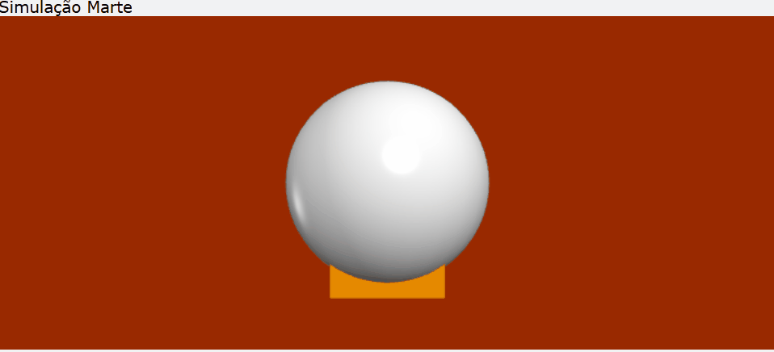
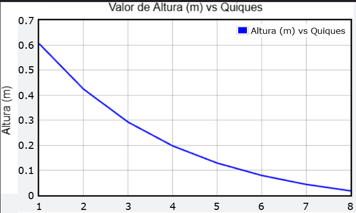
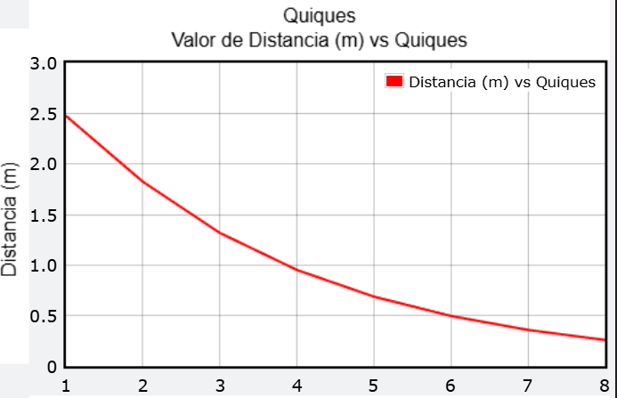
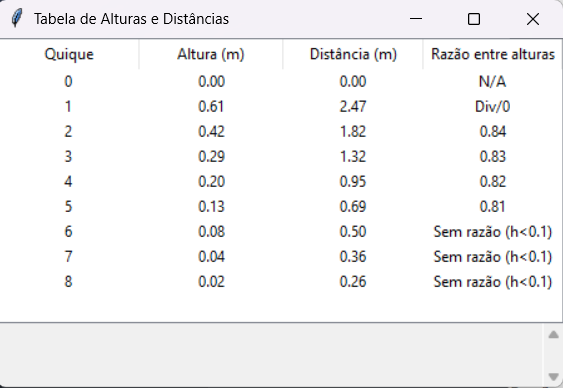

# 🏀 Aplicações de Séries Geométricas: Simulação 3D em Python

## 📖 Sobre o Projeto
Este é um projeto interdisciplinar que une **Cálculo 3, Estatística e Física** através da programação. O sistema implementa um algoritmo em Python focado em simular o lançamento de uma bola, modelando o comportamento matemático dos seus saltos sucessivos e seus movimentos em um plano 3D. 

A estrutura do código e a física desenvolvida formam uma base sólida para demonstrações de séries geométricas e servem de excelente material de apoio para apresentações em eventos acadêmicos de ciência e tecnologia, como o COBICET.

### 🎮 Demonstração da Simulação

## ✨ Funcionalidades e Motor Físico

* **Múltiplos Ambientes Gravitacionais:** Escolha entre 5 corpos celestes (Terra, Marte, Júpiter, Vênus e Lua), cada um com sua gravidade específica e uma identidade visual 3D própria na simulação.
* **Física de Materiais:** O simulador possui um banco de dados com a densidade e o coeficiente de restituição de 8 materiais diferentes (Borracha, PVC, Madeira, Gelo, Cimento, Ferro, Aço e Ósmio), permitindo o cálculo dinâmico da massa e do comportamento do impacto.
* **Resistência do Ar (Arrasto):** A simulação não ocorre no vácuo perfeito. O sistema calcula o arrasto atmosférico atuando na esfera utilizando a formulação de Stokes, onde o coeficiente de Stokes é definido por `b = 6πηr` *(sendo `η` a viscosidade do ar e `r` o raio da bola).*
* **Renderização 3D em Tempo Real:** Utiliza a biblioteca `vpython` para desenhar o ambiente, a trajetória parabólica com rastro e a colisão no solo, ajustando o centro da câmera dinamicamente.

## 🎛️ Entendendo o Painel de Controle

A interface gráfica foi desenhada para dar controle total sobre as variáveis físicas da simulação.

<table>
  <tr>
    <td width="40%" valign="top">
       
      
       
      <em>Figura 1: Visão geral dos parâmetros de entrada.</em>
    </td>
    <td width="60%" valign="top">
      <ul>
        <li><b>Razão da Progressão Geométrica (0 a 1):</b> Define manualmente a taxa de perda de energia da bolinha a cada quique. Só ativa se a caixa de seleção abaixo estiver desmarcada.</li>
        <li><b>Altura Inicial (m):</b> Posição no eixo Y de onde a bolinha será solta. Se <code>0</code>, inicia do solo.</li>
        <li><b>v0 (Velocidade - m/s):</b> A força inicial do disparo (projetada em 45º).</li>
        <li><b>Planeta:</b> Escolhe o corpo celeste, alterando a gravidade (<i>g</i>) e a cor de fundo da simulação 3D.</li>
        <li><b>Material:</b> Define a substância da bolinha, alterando a densidade (massa/arrasto) e carregando um coeficiente de restituição real.</li>
        <li><b>☑️ Usar coeficiente do material:</b>
          <ul>
            <li><i>Marcado:</i> Usa o coeficiente real do material (ex: Borracha = 0.925).</li>
            <li><i>Desmarcado:</i> Usa o valor digitado manualmente no primeiro campo.</li>
          </ul>
        </li>
        <li><b>Botão "Iniciar Simulação":</b> Abre a janela 3D do <code>vpython</code> e inicia a renderização.</li>
        <li><b>Botão "Print":</b> Imprime os dados brutos (gravidade, massa, Stokes b) na caixa de resultados sem rodar o visual.</li>
        <li><b>Resultados (Caixa de Texto):</b> Área onde o programa exibe os relatórios finais após a simulação, incluindo a soma geométrica das alturas, número de quiques e validações de erro.</li>
      </ul>
    </td>
  </tr>
</table>

## 📊 Análise Matemática e Relatórios

<table border="0">
  <tr>
    <td width="50%" valign="top">
      
       
      <em align="center">Fig 2. Decaimento da Altura</em>
    </td>
    <td width="50%" valign="top">
      
       
      <em align="center">Fig 3. Decaimento da Distância</em>
    </td>
  </tr>
</table>

* **Geração de Gráficos Analíticos:** Plota instantaneamente o decaimento exponencial da altura e da distância horizontal a cada quique, demonstrando visualmente o comportamento da Série Geométrica.

  
  
* **Interface de Relatórios Integrada:** Utiliza `tkinter` para gerar uma tabela de dados (Dataframe) com o resumo da simulação, calculando a razão analítica entre as alturas dos quiques sucessivos para validar o coeficiente de restituição: `e = √(h_n / h_{n-1})`.

## 🚀 Instruções para Execução da Simulação

Preparamos duas formas de rodar o projeto, garantindo acessibilidade para todos os usuários:

### Opção 1: Caso você já tenha o Python instalado no computador 🐍
1. Clone este repositório ou faça o download dos arquivos.
2. Localize o arquivo `rodar.bat` na pasta raiz do projeto.
3. Dê dois cliques sobre ele.
4. A simulação será compilada e iniciada automaticamente.

### Opção 2: Caso você NÃO tenha o Python instalado ⚙️
Não se preocupe, é possível rodar a versão portátil sem precisar instalar nada:
1. Acesse o nosso [Drive do Projeto]([https://drive.google.com/drive/u/1/folders/1hrkQ6KT9Tzk2gR-ZWeA1-NuMl6duYgnH](https://drive.google.com/file/d/1VjmPFqu_HosyFvEXrreGl7brmT3AtsYC/view?usp=sharing)).
2. Baixe e extraia a pasta `exe_vLeve.zip` para dentro do diretório deste projeto.
3. Dê dois cliques no arquivo `start.bat`.
4. O programa será executado utilizando o interpretador Python portátil que acompanha os arquivos extraídos.

## 👨‍💻 Contato e Contribuições
Sinta-se à vontade para explorar o código, abrir *issues* para tirar dúvidas ou enviar *pull requests* com melhorias para o algoritmo!
